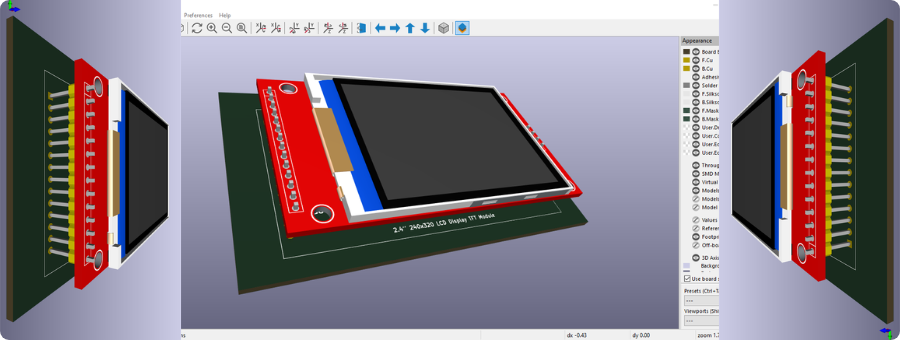

   

# 2.4" 240x320 LCD Display TFT Module Library

This folder contains a custom **KiCad** library for the `2.4" 240x320 TFT LCD display module`. It includes a **symbol**, **footprint**, and accurate **3D model**, created because this module was not available in KiCad or online.

## Contents

- **symbols:** `2.4_240x320_LCD_Display_TFT_Module.kicad_sym`
- **footprints:** `2.4_240x320_LCD_Display_TFT_Module.pretty`/`2.4_240x320_LCD_Display_TFT_Module.kicad_mod`
- **3dmodels:** `2.4_240x320_LCD_Display_TFT_Module.step`

## How to Use in KiCad

1. Add the symbol library:

   - Open a schematic file.
   - Go to `Preferences`, then `Manage Symbol Libraries`.
   - Click **Add existing library to table** (folder icon).
   - Browse to the `symbols` folder in this library and select the `.kicad_sym` file.
   - Click **OK**.

2. Add the footprint library:

   - Open a PCB file.
   - Go to `Preferences`, then `Manage Footprint Libraries`.
   - Click **Add Existing** (folder icon).
   - Browse to the `.pretty` folder inside `footprints` and select it.
   - Click **OK**.

3. Linking:

   - Adding the symbol to a schematic automatically links the footprint and 3D model.

## Notes

- Keep the folder structure intact to ensure all links remain correct.
- The 3D model can be visualized in KiCad’s 3D Viewer after placing the footprint.

This library can be used for ESP32, Arduino, or other embedded projects that require a 2.4" TFT LCD display.

Feel free to use this library in your projects and contribute by opening pull requests with other useful libraries!
