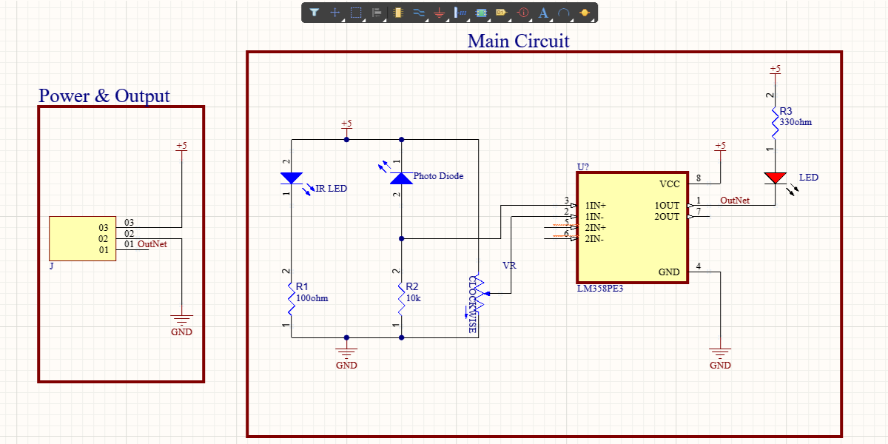
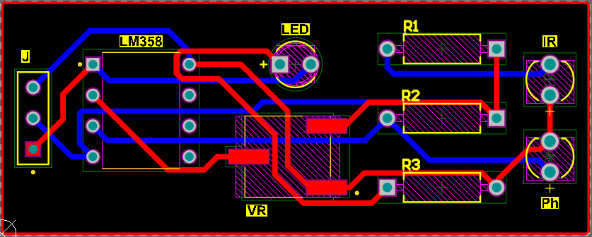
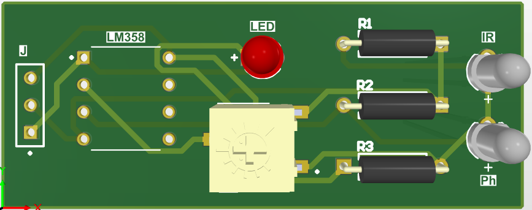

# PCB Projects

### The "pcb-projects" repo features various electronic PCB designs for enthusiasts. Explore for diverse projects and detailed documentation.

## 1. [LiPo Battery Charger](./LiPo%20Battery%20Charger/)

  
  

## 2. [IR Module](./IRModule/)

  
  

